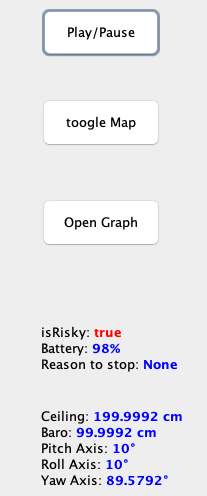
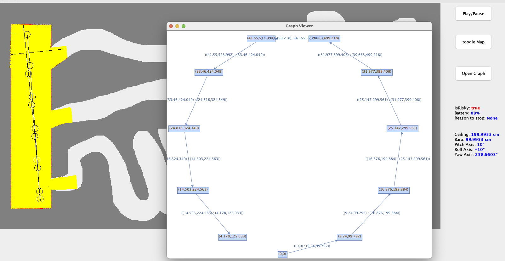
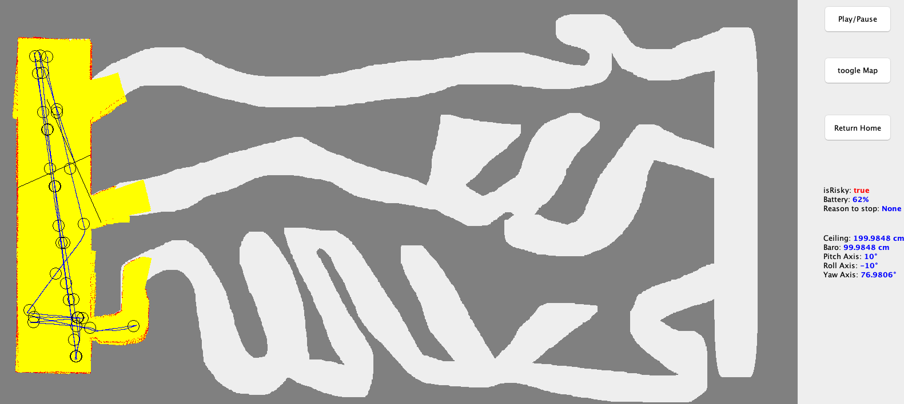

# Drone Simulator

### By Tom Shabalin, Dor Harizi and Shai Moshe

The main goal for this project is to try find good solution of small drone, flying inside indoor building without getting hit and crash.
The project fully autonomous 2d drone simulator, this simulator is trying to be realistic as much as it can, with lidar sensors,gyroscope sensor ,optical flow sensor and speed sensor.
We add a little bit noise to each sample to make it more realistic approach.
Basic API with real-time info and also manual controlling.
We also implemented kind of area mapping when the drone fly.
This project written in Java.

## How to run
After you installed the libraries required for the project, you can go do the SimulationWindow.java file and click the "RUN" button.

## Symbols 
- Yellow mark - mapped area.
- Black circle - his purpose to get some idea from where drone came and simply make some route that his passed.(for navigation)
- Red points - represents the wall point.
- Blue line - his whole route.

## API description
Really simple API with few buttons -
- Play/Pause button - plays and pauses the flight simulator.
- Toggle Map - allows you to hide the real map, entering to "real time" vision.
- Open Graph - opens a graph representing the actual part of the area where the drone visited.

## Requirement for running
Make sure to install the next libraries using Maven:
- JGrapht library.
- Mxgraph library.

## Images

